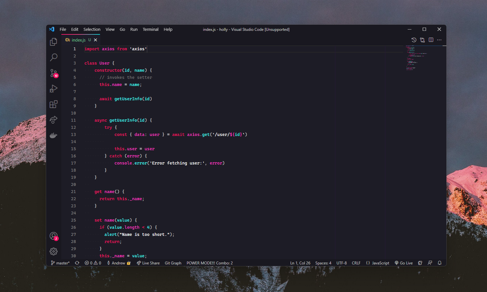
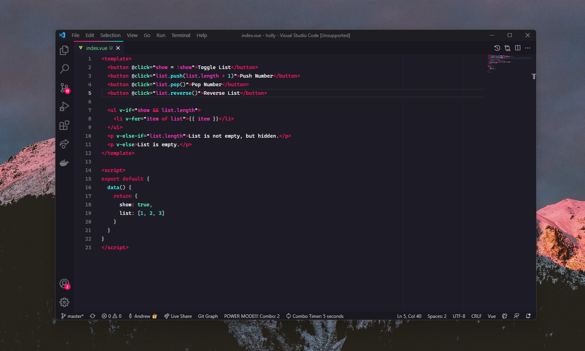
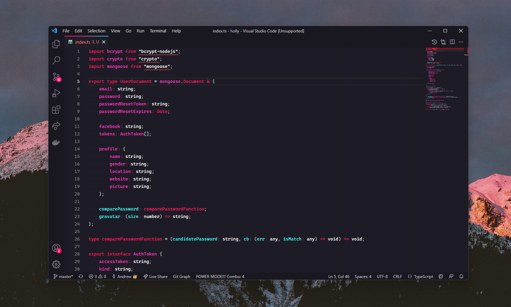

# Holly theme

This is a vibrant yet pretty dark theme for long hours of deep focused work.  

Syntax highlighting is carefully tinkered for working with HTML, CSS, Vue 2/3, TypeScript, Sass and Pug, since these are my main tools, but I'm looking forward to adjust this for other languages as well. 

I put many hours into develop this and I hope you'll enjoy it as much as I do. Such color scheme requires some time to adapt though. 

---

## Examples

### JS

### VUE

### TS


---

## Make it prettier

I highly recommend that you use the following font settings (put this in ```settings.json```):
```
{
    "editor.fontSize": 13,
    "editor.letterSpacing": 0.1,
    "editor.fontFamily": "'Cascadia Code', monospace",
    "editor.lineHeight": 22
}
```

The ```editor.fontFamily``` part is most vital for correct theme experience. You can download it from [officical repo](https://github.com/microsoft/cascadia-code).

---
## Even more prettier

You can run command with Command Pallate (ctrl+shift+P) Holly: Make it beatiful in order to apply additional styles, such as cute top tab border. 

But VSCode will give you an error, which you can safely dismiss.
Also, if you ever decide to remove/disable theme, you should run command "Holly: Unmake it beautiful" to disable all cosmetics and prevent them from overwriting other extensions.

